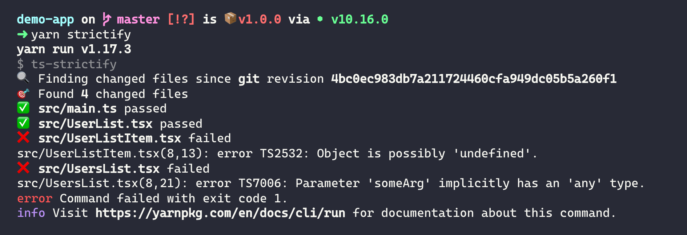

# `ts-strictify`

> Get Strict - eventually

Runs [TypeScript](hhttp://www.typescriptlang.org/) in strict mode on your changed files.



## How it works

When you start working on a new feature or fixing a bug, you will modify the code base in one way or another. `ts-strictify` will take a look at these changes - and only these changes (!) and will complain, if the files you have touched are not strict compliant.

That is different than TypeScript works. You could check a single file against the compiler, but the compiler would also look up the imports and the imports of the imports. Not exactly what you want, when you are looking for incrementally update path.

Supported source control managers:

- Git

## Install

With `yarn`:

```shellsession
yarn add --dev ts-strictify
```

With `npm`:

```shellsession
npm install --save-dev ts-strictify
```

## Usage

With `yarn`:

```shellsession
yarn ts-strictify
```

With [`npx`](https://npm.im/npx):

```shellsession
npx ts-strictify
```

With `npm`:

1. Add `"ts-strictify": "ts-strictify"` to the scripts section of `package.json`.
2. `npm run ts-strictify`

## Pre-Commit Hook

You can run `ts-strictify` as a pre-commit hook using [`husky`](https://github.com/typicode/husky).

```shellstream
yarn add --dev husky
```

In `package.json`, add:

```
"husky": {
  "hooks": {
    "pre-commit": "ts-strictify"
  }
}
```

<!-- ## CLI Flags -->
